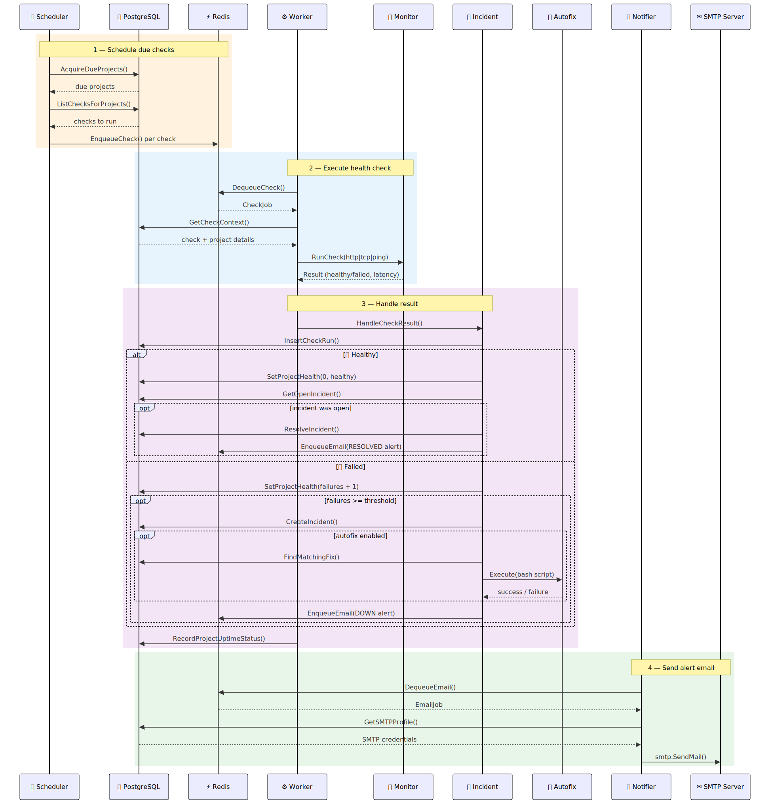

# Kraken

Kraken is a project-based uptime monitor with queue-driven checks, incidents, SMTP alerts, and autofix hooks.

## System Architecture

How the components connect — API, Scheduler, Worker, Notifier, and the data stores they share.



## Check Lifecycle

What happens when a check fires: scheduling → execution → incident handling → alerting.



## Data Model

The PostgreSQL tables and their relationships.



> Diagram sources live in `docs/diagrams/*.mmd`. Rebuild with:
>
> ```bash
> mmdc -i docs/diagrams/architecture.mmd -o docs/diagrams/architecture.svg -b transparent
> mmdc -i docs/diagrams/check-lifecycle.mmd -o docs/diagrams/check-lifecycle.svg -b transparent
> mmdc -i docs/diagrams/data-model.mmd -o docs/diagrams/data-model.svg -b transparent
> ```

---

## What You Can Run Now

- Monitor HTTP/TCP/Ping checks
- Deduplicate incidents (`1 open incident per project`)
- Trigger SMTP alerts on open/resolve/repeated failures
- Configure and run autofix scripts
- Use a built-in frontend to create projects, view logs/incidents/check runs, and run fixes

## Runtime Modes

- Single app (recommended): `cmd/app`
  - Runs API + scheduler + worker + notifier in one process
- Split mode (optional): `cmd/api`, `cmd/scheduler`, `cmd/worker`, `cmd/notifier`

## Quick Start

1. Start Postgres + Redis:

```bash
docker compose up -d
```

2. Configure env:

```bash
cp .env.example .env
export $(grep -v '^#' .env | xargs)
```

3. Run migration:

```bash
cat db/migrations/0001_init.sql | docker compose exec -T postgres psql -U postgres -d kraken
cat db/migrations/0002_uptime_rollups.sql | docker compose exec -T postgres psql -U postgres -d kraken
```

4. Start Kraken single app:

```bash
make app
```

5. Open UI:

- `http://localhost:8080/`

## Core API

- `GET /healthz`
- `GET /v1/projects`
- `POST /v1/projects`
- `DELETE /v1/projects/{projectID}`
- `PATCH /v1/projects/{projectID}/autofix`
- `GET /v1/projects/{projectID}/settings`
- `PUT /v1/projects/{projectID}/settings` (update project + paths/checks + alerts in one request)
- `GET /v1/projects/{projectID}/checks`
- `POST /v1/projects/{projectID}/checks`
- `GET /v1/projects/{projectID}/checks/{checkID}/runs` (per-path logs)
- `POST /v1/projects/{projectID}/run-now`
- `GET /v1/projects/{projectID}/logs`
- `GET /v1/projects/{projectID}/incidents`
- `GET /v1/projects/{projectID}/check-runs`
- `GET /v1/projects/{projectID}/paths/health` (per-path health summary)
- `GET /v1/projects/{projectID}/uptime?window=1h|12h|1d|7d|30d` (time-based uptime buckets)
- `GET /v1/projects/{projectID}/fixes`
- `POST /v1/projects/{projectID}/fixes`
- `POST /v1/projects/{projectID}/fixes/upload` (multipart `.sh` upload)
- `POST /v1/projects/{projectID}/fixes/{fixID}/run`
- `GET /v1/smtp_profiles`
- `POST /v1/smtp_profiles`

## Frontend Features

- Create project + path-based checks
- Trigger run-now checks
- Toggle autofix
- Create and attach fixes
- Upload `.sh` fix scripts from the UI and attach to projects
- Queue manual fix execution
- Delete projects from the project detail view
- View per-path health and per-path logs
- Edit project settings from UI (emails, paths/checks, intervals, thresholds, SMTP profile, autofix)
- View logs, incidents, recent check runs, and time-based uptime canvas

## Autofix Safety Baseline

- Script path constrained to `FIX_SCRIPTS_DIR`
- Command allowlist via `ALLOWED_FIX_COMMANDS`
- Per-fix execution timeout
- Full output logged to project logs table

## Notes

- SMTP password field currently stores value as-is in `password_encrypted`; replace with real encryption before production.
- Ping checks depend on system `ping` availability.
- UI files can be served directly from disk for faster iteration (`UI_DIR=internal/api/web`), so frontend changes appear without rebuilding/restarting in dev.
